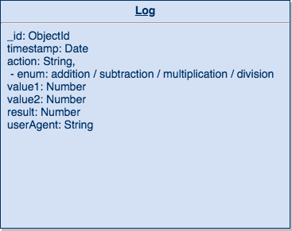
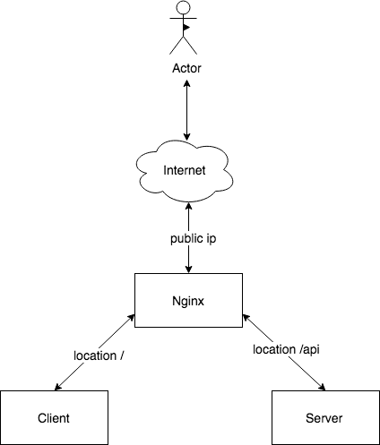
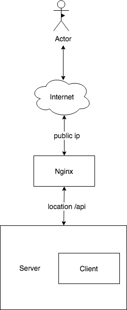

# Leflair Code Challenge

# 

The leflair test using the setup generated by create-react-app alongside a Node Express API server.

<strong><a href="https://lefcal.herokuapp.com/">View Demo</a> | <a href="">Download ZIP</a> </strong>

## Requirements

View [Requirements file](./requirementss.md).

## Design

### Database


### Architecture

#### Microservices


#### Server side rendering



## API Doc

View [Swagger YAML file](./server/swagger.yaml).

# Development

Clone this repository:

```sh
git clone https://github.com/khanghuynh92/leflair-code-challenge
```

## Fronend

```sh
cd frontend
```

Install dependencies:

```sh
yarn
```

Start the project at [`http://localhost:3000`](http://localhost:3000).

```sh
yarn start
```

## Backend

```bash
$ cd backend
```

Install dependencies:

```sh
yarn
```

Start the project at [`http://localhost:9000`](http://localhost:9000).

```sh
$ yarn start
```

Running unit tests

```sh
$ yarn test
```

Linting code

```sh
$ yarn lint
```

# Running with Docker
Update client proxy in client/package.json:

# 

Start via:

```
docker-compose up

# or detached
docker-compose up -d
```

Run a container of the server image via:

```
docker-compose run server /bin/bash
```

Check status:

```
docker-compose ps
```

Stop:

```
docker-compose down
```

Run the production:

```
docker-compose -f docker-compose.prod.yml up
```

Run the server side rendering production:

```
docker-compose -f docker-compose.ssr-prod.yml up
```

NOTE: if any dependencies change in package.json files, you probably will need to rebuild the container for the changes to appear, e.g.,

```
docker-compose down
docker-compose build
docker-compose up
```


# Deploying to Heroku

```bash
heroku create
git push heroku master
heroku open
```
Alternatively, you can deploy your own copy of the app using this button:

[](https://heroku.com/deploy?template=https://github.com/khanghuynh92/leflair-code-challenge)
